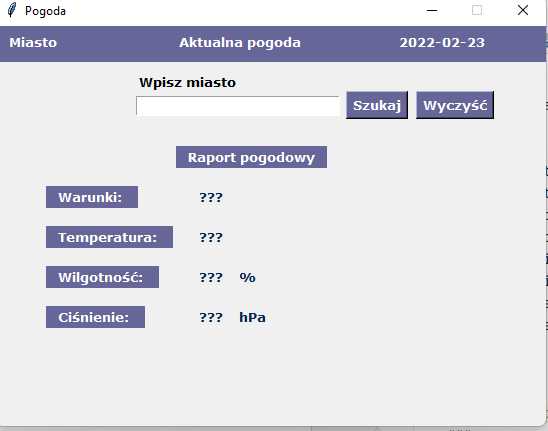

# Dillinger
## _The Last Markdown Editor, Ever_

[](https://nodesource.com/products/nsolid)

[](https://travis-ci.org/joemccann/dillinger)

# Aplikacja pogoda
> Szybka, krótka apka do pogody. Wykorzystuje API 

## Menu
* [Informacje ogólne](#informacje-oglne)
* [Zrzut ekranu](#zrzut-ekranu)
* [Technologie](#technologie)
* [Instalacja](#instalacja)
* [Kod](#kod)
* [Plan rozwoju](#plan-rozwoju)
* [Status](#status)
* [Inspiracje](#inspiracje)
* [Kontakt](#kontakt)

## Informacje ogólne
W ramach nauki i wykorzystania API napisałem aplikację do sprawdzania pogody

## Zrzut ekranu


## Technologie
* Python

## Instalacja
* PY plik do uruchomienia na dowolnym systemie operacyjnym po wcześniejszej instalacji Python interpreter 

## Przykładowy kod


```              self.location["text"] = self.data["name"] \
                                    + "," + self.data["sys"]["country"]
            self.c = int(self.data["main"]["temp_max"] - 273.15)
            self.weather["text"] = self.data["weather"][0]["main"]
            self.weather["font"] = ("verdana", 10, "bold")
            self.temperature["text"] = f"{self.c}°C \n"
            self.temperature["font"] = ("verdana", 10, "bold")
            self.humidity["text"] = self.data["main"]["humidity"]
            self.humidity["font"] = ("verdana", 10, "bold")
            self.pressure["text"] = self.data["main"]["pressure"]
            self.pressure["font"] = ("verdana", 10, "bold")
```


## Plan rozwoju

* EXE
* Wyjątki

## Status
Status projektu: _in progress_, 

## Inspiracje
Projekt autorski.

## Kontakt
Wykonany przez [@ithelparturgolata](ithelparturgolata@gmail.com) 